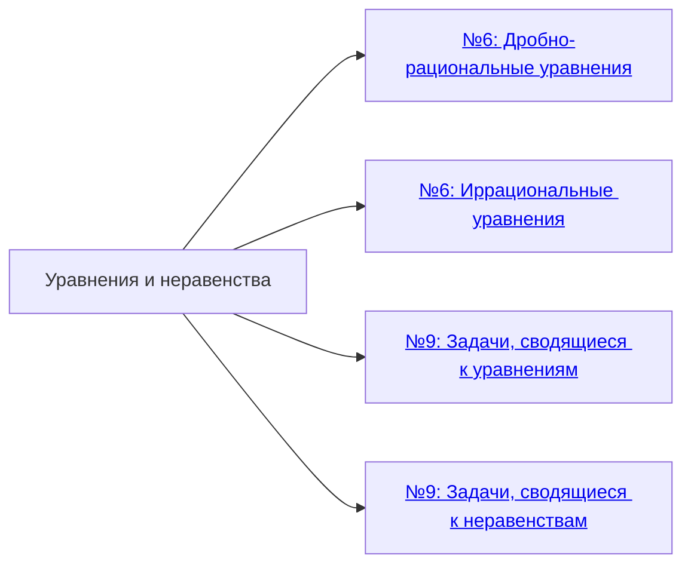
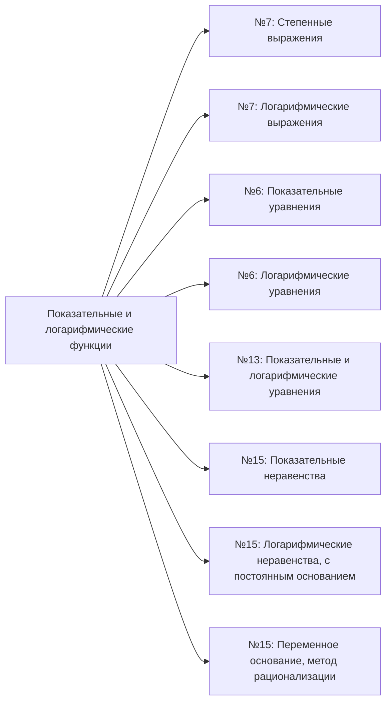
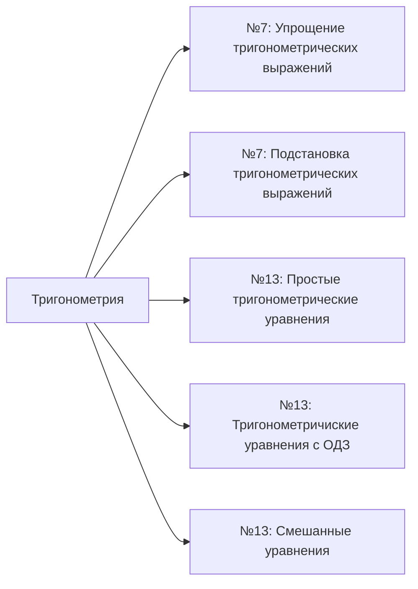
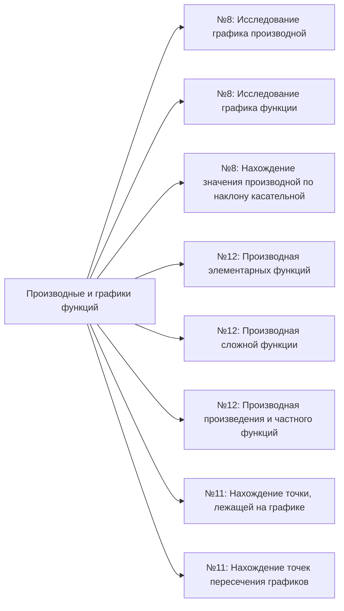
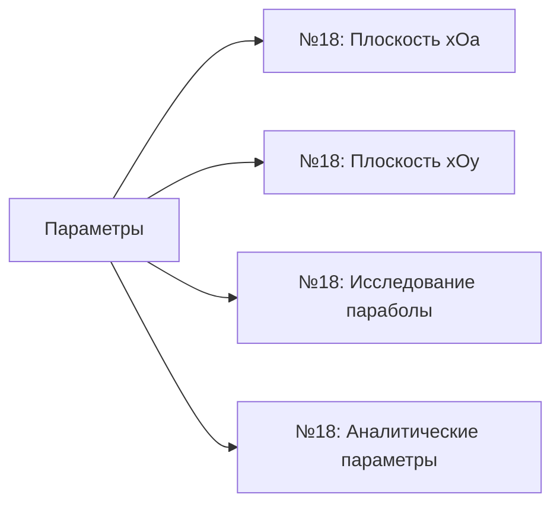
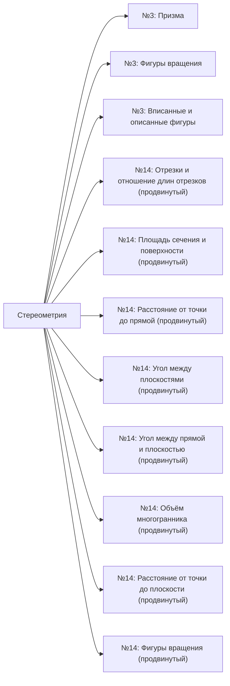
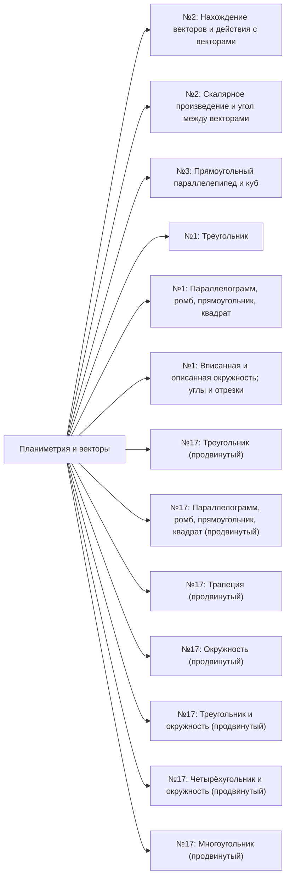
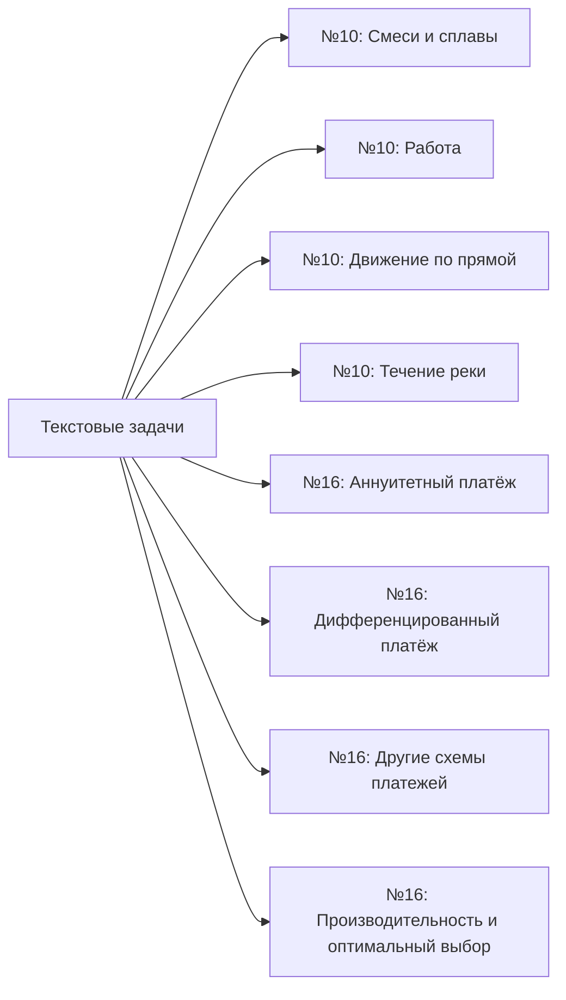
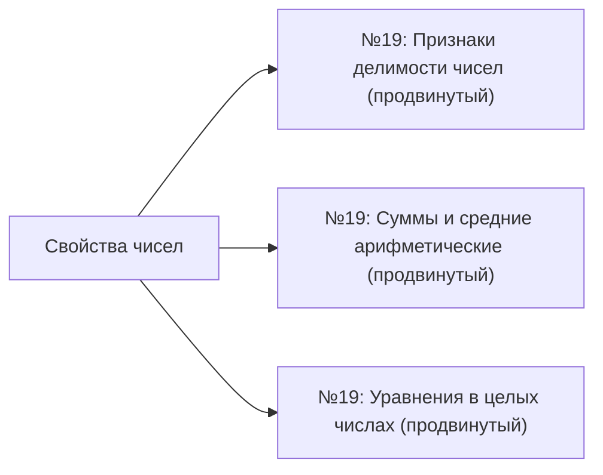
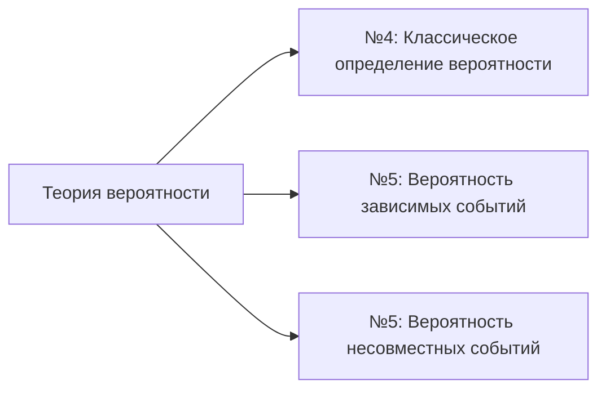

# ЕГЭ. Математика (профильный уровень). Описание заданий

Краткое описание заданий КИМ, рекомендуемое время, уровни сложности и шкала перевода баллов.

---

## 1. Структура экзамена и описание заданий

### Часть 1. Краткий ответ (число или дробь)

Ответом является **целое число** или **конечная десятичная дробь**.  
**Баллы:** 12 (по 1 за задание). **Время:** 20–30 мин на всю часть.

| № | Тема | Что нужно уметь | Балл | Время |
|:---:|:---|:---|:---:|:---:|
| 1 | Планиметрия. Фигуры на плоскости | Находить углы, стороны и площади в треугольниках и четырёхугольниках | 1 | 1 мин |
| 2 | Координаты и векторы | Находить координаты вектора, его длину и скалярное произведение | 1 | 1 мин |
| 3 | Стереометрия. Тела и поверхности вращения | Вычислять объёмы и площади поверхности куба, призмы, пирамиды, конуса, цилиндра | 1 | 1 мин |
| 4 | Простая вероятность | Применять классическую формулу вероятности (благоприятные исходы / все исходы) | 1 | 1 мин |
| 5 | Сложная вероятность | Использовать теоремы о сумме и произведении вероятностей, формулу Бернулли | 1 | 2 мин |
| 6 | Уравнения (иррац., показ., лог.) | Решать базовые иррациональные, логарифмические и показательные уравнения | 1 | 1 мин |
| 7 | Вычисления и преобразования | Преобразовывать числовые и буквенные выражения (степени, корни, тригонометрия) | 1 | 2 мин |
| 8 | Производная (геом. и физ. смысл) | Определять свойства функции по графику её производной (возрастание, экстремумы) | 1 | 2 мин |
| 9 | Задачи с прикладным содержанием | Подставить значения в сложную физическую формулу и выразить неизвестную переменную | 1 | 2 мин |
| 10 | Текстовые задачи (движение, работа, сплавы) | Решать задачи на движение по воде/дороге, совместную работу или концентрацию растворов | 1 | 2 мин |
| 11 | Графики функций | Находить коэффициенты (a, b, c, k) по изображённому графику и вычислять значение в точке | 1 | 2 мин |
| 12 | Производная функции | Находить минимум/максимум функции на отрезке с помощью вычисления производной | 1 | 2 мин |

### Часть 2. Развёрнутое решение

Необходимо записать **полное решение с обоснованием** каждого шага.  
**Баллы:** 20. **Время:** около 3,5 часа на всю часть.

| № | Тема | Что нужно уметь | Балл | Время |
|:---:|:---|:---|:---:|:---:|
| 13 | Тригонометрические уравнения | Решить тригонометрическое (реже логарифмическое) уравнение и отобрать корни на отрезке | 2 | 15–20 мин |
| 14 | Стереометрия (док-во и расчёт) | Доказать геометрический факт (п. а) и вычислить расстояние/угол в пространстве (п. б) | 3 | 25–40 мин |
| 15 | Неравенства (логарифм., показат.) | Решить логарифмическое или показательное неравенство методом интервалов или рационализации | 2 | 15–20 мин |
| 16 | Экономическая задача | Рассчитать схему погашения кредита (аннуитет/дифференцированные платежи) или оптимизацию | 2 | 15–25 мин |
| 17 | Планиметрия (док-во и расчёт) | Решить сложную задачу на окружности, подобие или площади (доказательство + расчёт) | 3 | 25–40 мин |
| 18 | Уравнения, неравенства и системы с параметрами | Найти все значения переменной $$a$$, при которых уравнение или система имеет заданное число корней | 4 | 40–50 мин |
| 19 | Числа и их свойства (теор. чисел, делим., преобр.) | Исследовать свойства чисел (делимость, прогрессии). Пункты «а» и «б» обычно решаются подбором | 4 | 40–50 мин |

**Итого:** 19 заданий, **32 первичных балла**, **3 ч 55 мин** (235 мин).

---

## 2. Уровень сложности и средний процент выполнения

| № в КИМ | Уровень | Ср. % вып. |
|:---:|:---:|:---:|
| 1 | Б | 82 |
| 2 | Б | 93 |
| 3 | Б | 68 |
| 4 | Б | 95 |
| 5 | П | 65 |
| 6 | Б | 95 |
| 7 | Б | 84 |
| 8 | Б | 76 |
| 9 | П | 83 |
| 10 | П | 74 |
| 11 | П | 79 |
| 12 | П | 80 |
| 13 | П | 43 |
| 14 | П | 6 |
| 15 | П | 19 |
| 16 | П | 18 |
| 17 | П | 8 |
| 18 | В | 2 |
| 19 | В | 2 |

**Уровни:** Б — базовый, П — повышенный, В — высокий.

---

## 3. Шкала перевода первичных баллов в тестовые (100-балльная шкала)

| Первичный балл | Тестовый балл |
|:---:|:---:|
| 1 | 6 |
| 2 | 11 |
| 3 | 17 |
| 4 | 22 |
| 5 | 27 |
| 6 | 34 |
| 7 | 40 |
| 8 | 46 |
| 9 | 52 |
| 10 | 58 |
| 11 | 64 |
| 12 | 70 |
| 13 | 72 |
| 14 | 74 |
| 15 | 76 |
| 16 | 78 |
| 17 | 80 |
| 18 | 82 |
| 19 | 84 |
| 20 | 86 |
| 21 | 88 |
| 22 | 90 |
| 23 | 92 |
| 24 | 94 |
| 25 | 95 |
| 26 | 96 |
| 27 | 97 |
| 28 | 98 |
| 29 | 99 |
| 30 | 100 |
| 31 | 100 |
| 32 | 100 |

---

## 4. Папки по подтемам заданий

### 4.1. Уравнения и неравенства

### 4.2. Показательные и логарифмические функции

### 4.3. Тригонометрия

### 4.4. Производные и графики функций

### 4.5. Параметры

### 4.6. Стереометрия

### 4.7. Планиметрия и векторы

### 4.8. Текстовые задачи

### 4.9. Свойства чисел

### 4.10. Теория вероятности

---

**Основано на:** КИМ ЕГЭ 2026, спецификация ФИПИ, открытый банк заданий.
